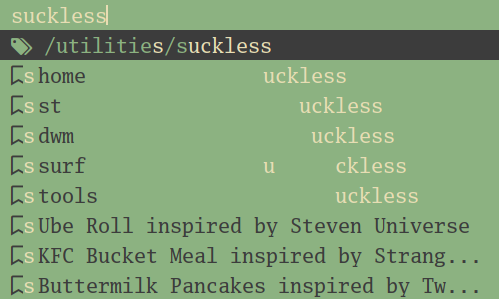

# NAME

__dmenu__ - dynamic menu

# SYNOPSIS

```
dmenu|dmenu_run [ -bfiv ] [ -l lines ]
                [ -m monitor ] [ -p prompt ]
                [ -L tl|tc|tr|ml|mc|mr|bl|bc|br]
                [ -fn font ] [ -nb color ] [ -nf color ]
                [ -sb color ] [ -sf color ] [ -nhb color ]
                [ -nhf color ] [ -shb color ] [ -shf color ]
                [ -w windowid ]
```

# DESCRIPTION
## `dmenu`

is a dynamic menu for X, which reads a list of
newline-separated items from stdin.  When the user selects
an item and presses Return, their choice is printed to
stdout and dmenu terminates.  Entering text will narrow the
items to those matching the tokens in the input.

## `dmenu_run`

is a script used by `dwm` which lists programs in the
user's `$PATH` and runs the result in their `$SHELL`.

## My patches

- [x] [dmenu-caseinsensitive-20200523-db6093f.diff](https://tools.suckless.org/dmenu/patches/case-insensitive/)
- [x] [dmenu-fuzzyhighlight-4.9.diff](https://tools.suckless.org/dmenu/patches/fuzzyhighlight/)
	- But it doesn't draw correctly over the marked-up text,
	  so it currently shows matched characters in the whole
	  line of text, not just the pango output:



- [x] [dmenu-fuzzymatch-4.9.diff](https://tools.suckless.org/dmenu/patches/fuzzymatch/)
- [x] [dmenu-lineheight-4.9.diff](https://tools.suckless.org/dmenu/patches/line-height/)
- [x] [dmenu-mousesupport-4.9.diff](https://tools.suckless.org/dmenu/patches/mouse-support/)
- [x] [dmenu-xyw-4.7.diff](https://tools.suckless.org/dmenu/patches/xyw/)
- [x] [dmenu-pango-4.9-20200612.diff](https://raw.githubusercontent.com/StillANixRookie/dmenu-pango/master/dmenu-pango-4.9-20200612.diff)
	- this is my own patch, it won't be on the suckless site
- [ ] [dmenu-pango-imlib](https://github.com/Cloudef/dmenu-pango-imlib)
	- this one I'm still trying to sort out.

# OPTIONS

`-b`  
dmenu appears at the bottom of the screen. Doesn't exist
any more because this is handled by -L

`-f`  
dmenu grabs the keyboard before reading `stdin` if not reading
from a tty. This is faster, but will lock up X until stdin
reaches end-of-file.

`-s`  
dmenu matches menu items case _sensitively_.

`-l <lines>`  
dmenu lists items vertically, with the given number of lines.

`-h <height>`  
dmenu uses a menu line of at least `<height>` pixels tall, but
no less than 8.

`-x <xoffset>`  
dmenu is placed at this offset measured from the left side
of the monitor.  
Can be negative.  
If option `-m` is present, the measurement will use the
given monitor.

`-y  <yoffset>`  
dmenu is placed at this offset measured from the top of the
monitor.  If the `-b` option is used, the offset is measured
from the bottom.  
Can be negative.  
If option `-m` is present, the measurement will use the
given monitor.

`-w  <width>`  
sets the width of the dmenu window.

`-L tl|tc|tr|ml|mc|mr|bl|bc|br`  
Where to draw `dmenu`.  
```
tl tc tr
ml mc mr
bl bc br
```

`-m  <monitor>`  
dmenu is displayed on the monitor number supplied. Monitor
numbers are starting from 0.

`-p  <prompt>`  
defines the prompt to be displayed to the left of the input
field.

`-fn  <font>`  
defines the font or font set used.

`-nb  <color>`  
defines the normal background color.
`#RGB`, `#RRGGBB`, and X color names are supported.

`-nf  <color>`  
defines the normal foreground color.

`-sb  <color>`  
defines the selected background color.

`-sf  <color>`  
defines the selected foreground color.

`-nhb  <color>`  
defines the normal highlight background color.

`-nhf  <color>`  
defines the normal highlight foreground color.

`-shb  <color>`  
defines the selected highlight background color.

`-shf  <color>`  
defines the selected highlight foreground color.

`-v`  
prints version information to stdout, then exits.

`-w  <windowid>`  
embed into windowid.

# USAGE

dmenu is completely controlled by the keyboard, but this
fork has the `mousesupport` patch, heheh.  Items are
selected using the arrow keys, page up, page down, home, and
end.

__Tab__  
Copy the selected item to the input field.

__Return__  
Confirm selection.  Prints the selected item to stdout and
exits, returning success.

__Ctrl-Return__  
Confirm selection.  Prints the selected item to stdout and
continues.

__Shift-Return__  
Confirm input. Prints the input text to stdout and exits,
returning success.

__Escape__  
Exit without selecting an item, returning failure.

__Ctrl-Left__  
Move cursor to the start of the current word

__Ctrl-Right__  
Move cursor to the end of the current word

__C-a__  
Home

__C-b__  
Left

__C-c__  
Escape

__C-d__  
Delete

__C-e__  
End

__C-f__  
Right

__C-g__  
Escape

__C-h__  
Backspace

__C-i__  
Tab

__C-j__  
Return

__C-J__  
Shift-Return

__C-k__  
Delete line right

__C-m__  
Return

__C-M__  
Shift-Return

__C-n__  
Down

__C-p__  
Up

__C-u__  
Delete line left

__C-w__  
Delete word left

__C-y__  
Paste from primary X selection

__C-Y__  
Paste from X clipboard

__M-b__  
Move cursor to the start of the current word

__M-f__  
Move cursor to the end of the current word

__M-g__  
Home

__M-G__  
End

__M-h__  
Up

__M-j__  
Page down

__M-k__  
Page up

__M-l__  
Down

# SEE ALSO

dwm, stest
